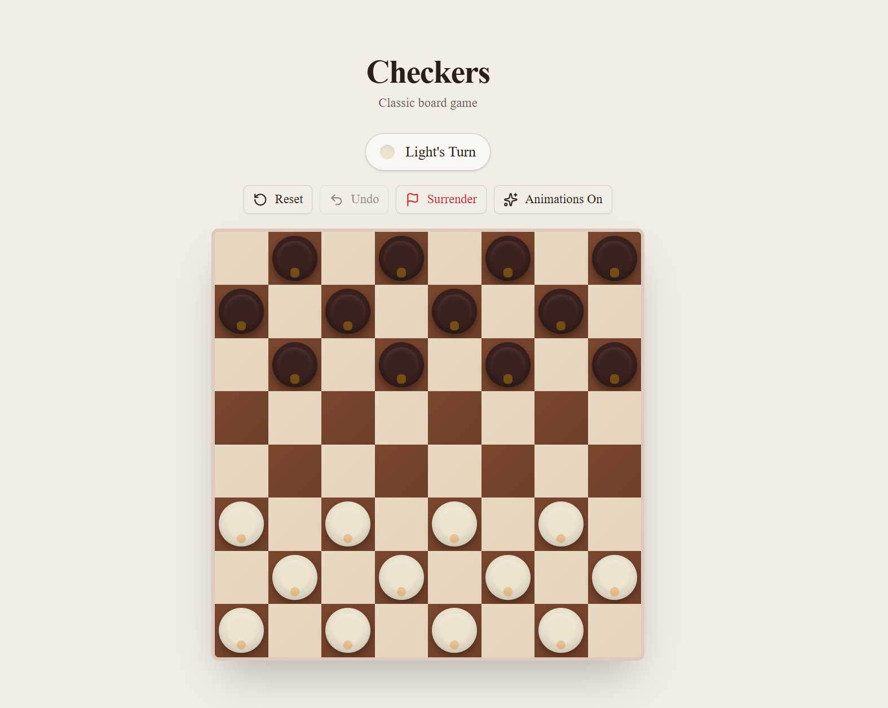
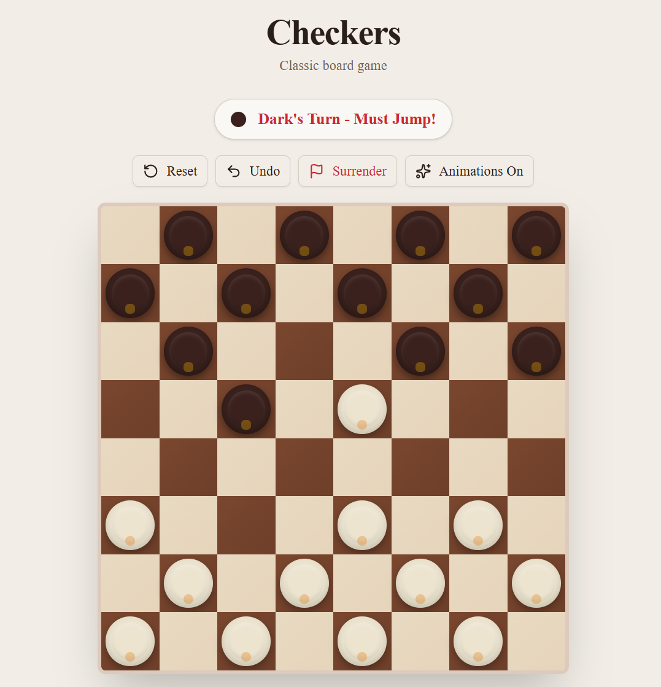
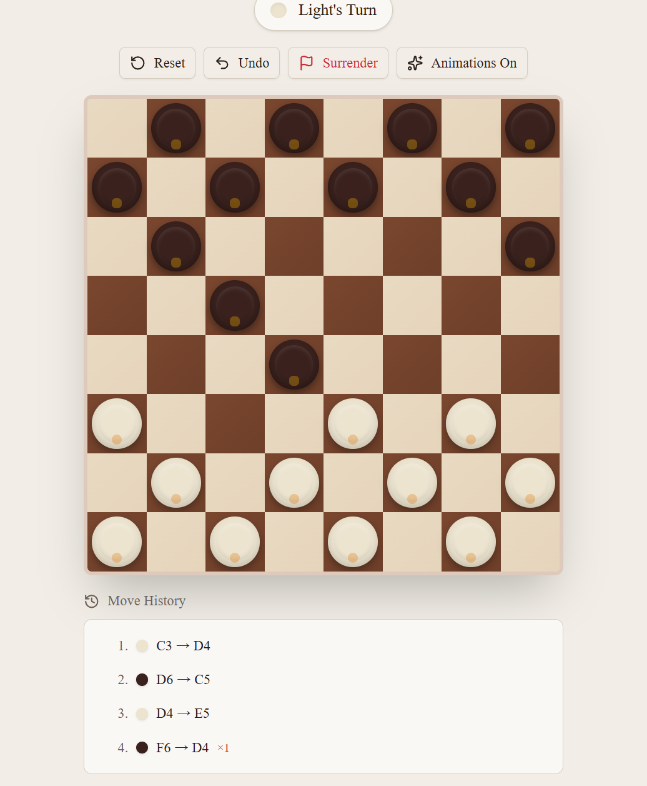

# Checkers

A modern, responsive checkers game built with Next.js, React, TypeScript, and Tailwind CSS.

It recreates the classic two-player board game with smooth interactions, forced captures, king promotion, move history, local save support, and a clean interface that works well on both desktop and mobile.

## Live Project

- Live Demo: [checkers-eight-nu.vercel.app](https://checkers-eight-nu.vercel.app/)
- Repository: [github.com/eenock/Checkers](https://github.com/eenock/Checkers)

## Screenshots







## Highlights

- Classic 8x8 checkers board with the standard opening setup
- Forced-capture rule enforcement
- Multi-jump capture chains
- King promotion at the far rank
- Win detection when a player has no pieces or no legal moves
- Draw detection after 50 non-capturing moves
- Undo for the last completed turn
- Surrender, reset, and animation toggle controls
- Move history with capture and promotion indicators
- First-visit tutorial overlay
- Local storage persistence for in-progress games
- Responsive layout with keyboard-friendly interactions

## Tech Stack

- Next.js 16
- React 19
- TypeScript
- Tailwind CSS 4
- Framer Motion
- Lucide React

## Getting Started

### Prerequisites

- Node.js 20 or newer
- npm

### Install

```bash
npm install
```

### Run Locally

```bash
npm run dev
```

Visit `http://localhost:3000`.

## Scripts

```bash
npm run dev
npm run build
npm run start
npm run lint
```

## Gameplay Rules

- Light moves first.
- Regular pieces move diagonally forward by one square.
- Captures are mandatory when available.
- If a jump creates another jump, the same piece must continue capturing.
- Reaching the opposite end of the board promotes a piece to a king.
- Kings can move diagonally in both directions.

## Deployment

This project is ready to deploy on Vercel.

1. Push the repository to GitHub.
2. Import `eenock/Checkers` into Vercel.
3. Keep the default Next.js framework settings.
4. Add any production environment variables from `.env` if needed.
5. Deploy.

Current production URL: [checkers-eight-nu.vercel.app](https://checkers-eight-nu.vercel.app/)

## Project Structure

```text
app/
  layout.tsx
  page.tsx
components/
  checkers/
    board.tsx
    game.tsx
    game-controls.tsx
    move-history.tsx
    piece.tsx
    square.tsx
    tutorial.tsx
    win-celebration.tsx
lib/
  checkers/
    game-logic.ts
    game-reducer.ts
    types.ts
public/
  screenshots/
```

## Quality Checks

The project currently passes:

- `npm run lint`
- `npm run build`
- `npx tsc --noEmit`

## Roadmap

- Add a single-player AI opponent
- Add sound effects and optional music
- Add difficulty levels
- Add online multiplayer
- Add focused tests for move generation and reducer behavior

## Contributing

Issues, ideas, and pull requests are welcome. For larger changes, opening an issue first is a good way to discuss the direction before implementation.

## License

This project is licensed under the MIT License. See [LICENSE](./LICENSE) for details.
